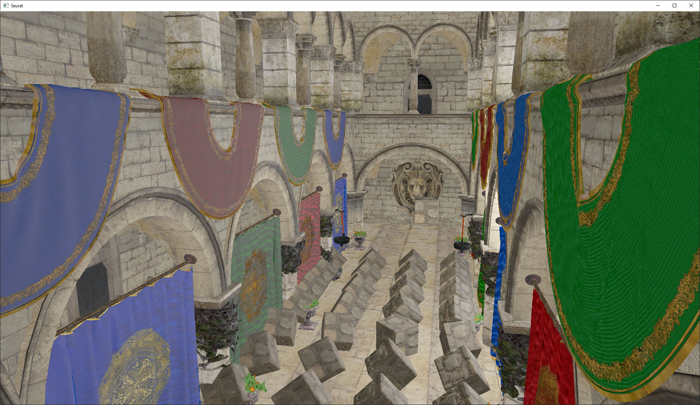

# Seurat Render Engine

Seurat is a basic render engine written in [Rust](https://www.rust-lang.org/) with [WGPU](https://wgpu.rs/) for learning purposes. It integrates various post-processing effects like HDR exposure, motion blur, SSAO, and deferred shading. The lighting model uses an (imperfect) implementation of PBR shading based on the [Learn OpenGL PBR series](https://learnopengl.com/PBR/Theory) sans the final chapter on image-based lighting.

The (badly lit) demo scene is the PBR version of Sponza 2.0 [from here](https://github.com/KhronosGroup/glTF-Sample-Models/tree/master/2.0/Sponza).

It is named after the notable [pointilist](https://en.wikipedia.org/wiki/Pointillism) artist [Georges Seurat](https://en.wikipedia.org/wiki/Georges_Seurat) because the GPU renders fragments as small dots of color. By comparison, my first 3D engine [Picasso](https://github.com/Keavon/Picasso) (written in Java) renders its scenes on the CPU using polygons layered with the [painter’s algorithm](https://en.wikipedia.org/wiki/Painter%27s_algorithm). Those polygons resemble the [cubist](https://en.wikipedia.org/wiki/Cubism) style of [Pablo Picasso](https://en.wikipedia.org/wiki/Pablo_Picasso) where that 3D engine took its name.
